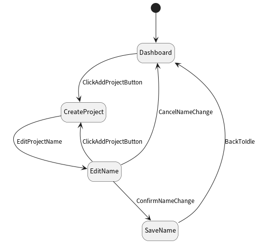
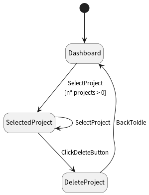

# Assignment 4 - G03P02

## Group information

- Ana Inês Oliveira de Barros - `up201806593@fe.up.pt`;
- João de Jesus Costa - `up201806560@fe.up.pt`

## Use-cases

We selected the following use-cases, because they were both common use-cases for
the application and the most interesting to test/draw a model for:

- Add a new project;
- Play/pause a project;
- Edit a project's color;

### Use-case 1 - add a new project

Adding a new project is fundamental for using the application.

The **state diagram**:

The **transition tree**:

The **transition table**:

|                          | Add          | CancelNameChange | ConfirmNameChange | Maximize     | Minimize             |
| ------------------------ | ------------ | ---------------- | ----------------- | ------------ | -------------------- |
| **_AddProject_**         | _AddProject_ | _Dashboard_      | _Dashboard_       |              | _MinimizedToTrayAdd_ |
| **_Dashboard_**          | _AddProject_ |                  |                   |              | _MinimizedToTray_    |
| **_MinimizedToTray_**    |              |                  |                   | _Dashboard_  |                      |
| **_MinimizedToTrayAdd_** |              |                  |                   | _AddProject_ |                      |

### Use-case 2 - play/pause a project

This is the main function of the application.

### Use-case 3 - edit a project's color

Color coding tasks is a common organization method for time
scheduling/organization methods. A time scheduling application should have this
feature.

