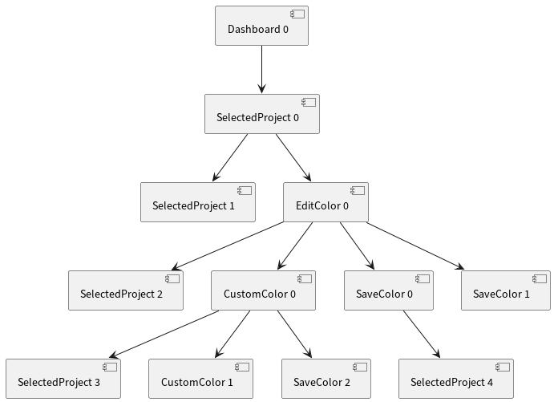

# Assignment 4 - G03P02

## Group information

- Ana Inês Oliveira de Barros - `up201806593@fe.up.pt`;
- João de Jesus Costa - `up201806560@fe.up.pt`

## Use-cases

We selected the following use-cases, because they were both common use-cases for
the application and the most interesting to test/draw a model for:

- Add a new project;
- Play/pause a project;
- Edit a project's color;

### Use-case 1 -- Add a new project

Adding a new project is fundamental for using the application.

#### State diagram

The most important aspects of this use-case are:

- When a user **adds** a project while **adding another one** i.e., still
  editing its name, the name change is confirmed and the user is prompted for
  the name of the new project;
- Upon creating a new project, the user is immediately prompted to edit 
the project's name. However, there is the possibility to cancel this action 
(the project will keep the default name).

We decided that the application's end-state is the moment the
application is closed. However, we chose to ommit it since every 
state would have a transition to it. 

#### Transition tree

With 3 leaf nodes in the tree, we need to create 3 tests to cover all states and
transitions of the system.

#### Transition table

|                     | ClickAddProjectButton | EditProjectName | ConfirmNameChange | BackToIdle  | CancelNameChange |
| ------------------- | --------------------- | --------------- | ----------------- | ----------- | ---------------- |
| **_Dashboard_**     | _CreateProject_       |                 |                   |             |                  |
| **_CreateProject_** |                       | _EditName_      |                   |             |                  |
| **_EditName_**      | _CreateProject_       |                 | _SaveName_        |             | _Dashboard_      |
| **_SaveName_**      |                       |                 |                   | _Dashboard_ |                  |

According to the table, there are 14 sneak paths.

#### Tests

The tests are numbered with the same order as the leaf nodes in the tree
(left-to-right).

1. Start app ⇒ Create project ⇒ Edit name ⇒ Confirm name change
   - **Verification**: verify project exists and is called "test project".
2. Start app ⇒ Create project ⇒ Edit name ⇒ Cancel name change
   - **Verification**: verify project exists and is called "New project" (default name).
3. Start app ⇒ Create project ⇒ Create new project  ⇒ Cancel name change
   - **Verification**: verify both project exist.

All tests pass successfully.

### Use-case 2 - Delete a project

This is the main function of the application.

#### State diagram

The most important aspects of this use-case are:

- It is possible to delete any created project (even if it is running).
- The user can only shave one selected project at a time.
- While having one selected project, the only way to have no selected projects is to delete the current project.

We decided that the application's end-state is the moment the
application is closed. However, we chose to ommit it since every 
state would have a transition to it. 

#### Transition tree

With 2 leaf nodes in the tree, we need to create 2 tests to cover all states and
transitions of the system.

#### Transition table

|                       | SelectProject [nº projects > 0] | SelectProject     | ClickDeleteButton | BackToIdle  |
| :-------------------- | :----------------------------------- | :---------------- | ----------------- | ----------- |
| **_Dashboard_**       | *SelectedProject*                    |                   |                   |             |
| **_SelectedProject_** |                                      | _SelectedProject_ | _DeleteProject_   |             |
| **DeleteProject**     |                                      |                   |                   | _Dashboard_ |

According to the table, there are 8 sneak paths.

#### Tests

The tests are numbered with the same order as the leaf nodes in the tree
(left-to-right). Each test implies some previous setup.

1. Start app ⇒ Select one project ⇒ Select another project 

   - **Setup:** Create two projects.
   - **Verification:** Check if the correct project is selected.

2. Start app ⇒ Select project ⇒ Delete project 

   - **Setup:** Create one project.

   - **Verification:** Check if project no longer exists.

All tests pass successfully.

### Use-case 3 - Edit a project's color

Color coding tasks is a common organization method for time
scheduling/organization methods. A time scheduling application should have this
feature.

#### State diagram

The most important aspects of this use-case are:

- It is possible to choose a custom color instead of the predefined ones.
- We omitted the states around the custom color selection menu: there are 5 tabs
  reachable from all other tabs. This leads to _explosion of states_ that
  doesn't add anything to the analysis.

We decided that the application's end-state is the moment the
application is closed. However, we chose to ommit it since every 
state would have a transition to it. 

#### Transition tree

With 6 leaf nodes in the tree, we need to create 6 tests to cover all states and
transitions of the system.

#### Transition table

|                     | SelectProject [nº projects > 0] | SelectProject     | ClickEditColorButton | CancelColorEdit   | SelectColor | RemoveColor | OpenCustomColorMenu | ResetColor    | BackToIdle        |
| ------------------- | ------------------------------------ | ----------------- | -------------------- | ----------------- | ----------- | ----------- | ------------------- | ------------- | ----------------- |
| **Dashboard**       | _SelectedProject_                    |                   |                      |                   |             |             |                     |               |                   |
| **SelectedProject** |                                      | _SelectedProject_ | _EditColor_          |                   |             |             |                     |               |                   |
| **EditColor**       |                                      |                   |                      | _SelectedProject_ | _SaveColor_ | _SaveColor_ | _CustomColor_       |               |                   |
| **CustomColor**     |                                      |                   |                      | _SelectedProject_ |             |             |                     | _CustomColor_ |                   |
| **SaveColor**       |                                      |                   |                      |                   |             |             |                     |               | _SelectedProject_ |

According to the table, there are 35 sneak paths.

#### Tests

The tests are numbered with the same order as the leaf nodes in the tree
(left-to-right). The setup of all tests involves adding a project to the list.

1. Start app ⇒ Select one project ⇒ Select another project 
   - **Setup:** Create two projects.
   - **Verification:** Check if the correct project is selected.
2. Start app ⇒ Select one project ⇒ Edit color ⇒ Cancel color edit.
   - **Setup:** Create one projects.
   - **Verification:** Check if the project remains colorless.
3. Start app ⇒ Select one project ⇒ Edit color ⇒ Open custom color menu ⇒ Cancel color edit
   - **Setup:** Create one project.
   - **Verification:** Check if the project remains colorless.
4. Start app ⇒ Select one project ⇒ Edit color ⇒ Open custom color menu ⇒ Reset color selection
   - **Setup:** Create one project.
   - **Verification:** Check if the project has is white (we set the color in order to test it).
5. Start app ⇒ Select one project ⇒ Edit color ⇒ Open custom color menu ⇒ Select custom color (pink) ⇒ Set custom color
   - **Setup:** Create one project.
   - **Verification:** Check if the project's color is pink.
6. Start app ⇒ Select one project ⇒ Edit color ⇒ Remove color 
   - **Setup:** Create one project with color green.
   - **Verification:** Check if the project became colorless.
7. Start app ⇒ Select one project ⇒ Edit color ⇒ Select color (green) 
   - **Setup:** Create one project.
   - **Verification:** Check if the project became green.

All tests pass successfully.

## Sneak paths

We decided to test one sneak path from each use-case.

### Use-case 1's sneak path

Cancel a name change while on the dashboard. This corresponds to being in the
_Dashboard_ state and receiving a **CancelNameChange** event.

The test fails, because **QF-Test** isn't able to deliver the event.

### Use-case 2's sneak path

### Use-case 3's sneak path

Remove a project's color while on the dashboard (color edit menu not open). This
corresponds to being in the _Dashboard_ state and receiving a **RemoveColor**
event.

The test fails, because **QF-Test** isn't able to deliver the event.

## QF-Test tool feedback

This feedback was written for the QF-Test tool usage under Arch linux. 
Overall, using QF-Test tool was a positive experience. It was easy to learn how to start using the tool by making simple tests. The application has an intuitive interface, but in order to take the most advantage of the tool and to find out all features, we had to read the documentation and watch some tutorials.

The tool was really useful for Model-based testing, but there were some problems along the way that mainly due to bugs. The application we were testing had some features that involved the icon tray menu. Recorded actions that involved interaction with the tray icon were not reliable since they would only work sometimes. Another difficulty that arose was the verification of visual clues. We wanted to test whether some item was selected or with a different color, but it took a bit of time to understand that the tool was not working as intended. We had to go through a comple