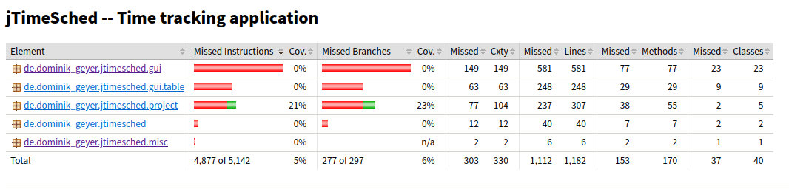
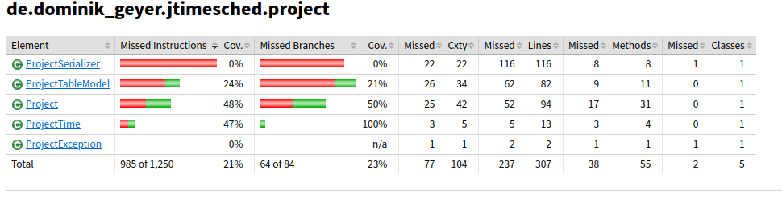
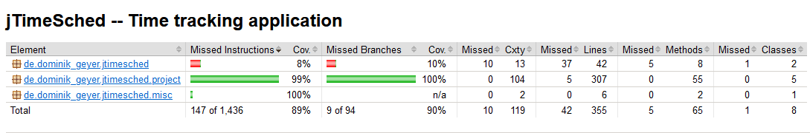

# Assignment 5 - G03P02

## Group information

- Ana Inês Oliveira de Barros - `up201806593@fe.up.pt`;
- João de Jesus Costa - `up201806560@fe.up.pt`

## Structural Testing

Structural testing is white-box testing technique that provides a systematic way to devise tests. The tests are based 
on different criteria. For this assignment, the criteria we will be focusing on
line and decision coverage.  

We used [JaCoCo Code Coverage Library for Java](https://www.jacoco.org/jacoco/) to collect
code coverage. Unit tests were written using the [JUnit framework](https://junit.org/junit5/).
We reached a line and branch coverage of at least 90% for all classes except for *GUI* related classes. 
## Previous assignments coverage 

For both assignment #2 and #3, we wrote a few unit tests using a black-box testing technique.
The two images below show how much coverage these unit tests generated: 21% for the _de.dominik.\_geyer.jtimesched.project_ package and 0% for the rest of the packages. 

As a result of this analysis, since there are no classes with both line and brach coverage at 90% or more, it was required to write unit tests for every class (except _GUI_ related ones).

## Unit tests

This section provides a brief description and the result of each unit test we developed in order to increase project's code coverage. 

### de.dominik_geyer.jtimesched.misc tests

#### PlainTextFormatter.java

1. **Format**
    - **Description**: Given a log record (a message, severity and time), this test checks whether the output is formatted as intended. 

**Result**: All tests pass successfully.

### de.dominik_geyer.jtimesched.project tests

#### Project.java

- **Setup**: Before each test a new project is created, its number of seconds today is set to 10 and the number of seconds overall is set to 30.

1. **Get elapsed seconds not running project**
    - **Description**: This test stops the project and tries to access the project's number of elapsed seconds. The test succeeds if a _ProjectException_ is thrown. 

2. **Start a running project**
    - **Description**: This test starts the project and attempts to start it again. The test succeeds if a _ProjectException_ is thrown.

3. **Pause a paused project**
    - **Description**: This test pauses the project and attempts to pause it again. The test succeeds if a _ProjectException_ is thrown. 

4. **Toggle stopped project**
    - **Description**: Given a paused project, this test toggles the project and checks if the state of the project changed. The test succeeds if a project ended up in the _running_ state. 

5. **Toggle running project**
    - **Description**: Given a running project, this test toggles the project and checks if the state of the project changed. The test succeeds if a project ended up in the _paused_ state. 

6. **Reset today seconds**
    - **Description**: This test tries to reset a project for today. The test succeeds if it was successfully reset: number of seconds today is 0, quota for today is 0, and the start time is equal to the moment the test executes.  

**Result**: All tests pass successfully.
#### ProjectSerializer.java

1. **Read/Write XML**
    - **Description**: This parameterized test receives as input different projects: one default project, a checked project, a project with a set color, a project with notes and another one with a null title. Then, the tests are saved in an *XML* file, and recovered from the same file. The test succeeds if the projects are equal (read and write operations were correct). 

2. **Write XML running project**
    - **Description**: Creates a new project, sets it as running, and saves it to the XML file.
    Then, the project is read from the same XML file. The test succeeds if the project is the same and not running (running projects are saved as not running). 

3. **Read XML running project**
    - **Description**: Creates a new project, sets it as running, and saves it to the XML file. Then, the XML file is edited to set the project as running and we proceed to read the project from the same XML file. The test succeeds if the project is the same and running.

4. **Read/Write XML project no quota**
    - **Description**: Creates a new project, saves it to the XML file and edits the file in order to remove the line corresponding to the project's quota. Then, the project is read from the same XML file. The test succeeds if the project is the same.

5. **Read/Write XML project no notes**
    - **Description**: Creates a new project, saves it to the XML file and edits the file in order to remove the line corresponding to the project's notes. Then, the project is read from the same XML file. The test succeeds if the project is the same.
    
**Result**: All tests pass successfully.
#### ProjectTableModel.java

1. **Set value**
    - **Description**: The test starts by creating a _ProjectTableModel_ that contains a single project. Then, for each settable value of a project (title, date, color, etc), this parametrized test receives different values as inputs and checks if the vallue was correctly set. 

2. **Set value at invalid Column**
    - **Description**: The test starts by creating a _ProjectTableModel_ that contains a single project. Then, it tries to set to true the value of the
    _STARTPAUSE_ column. The test succeeds if the value was not set (this type of columns are not settable).

3. **Add project**
    - **Description**: The test starts by creating a _ProjectTableModel_ that does not contain any project. Then, it tries to add a new project to the table. The test succeeds if the project was successfully added. 

4. **Remove project**
    - **Description**: The test starts by creating a _ProjectTableModel_ that contains a single project. Then, it tries to remove the project from the table. The test succeeds if the project was successfully removed.     

5. **Get column class**
    - **Description**: The test starts by creating an empty _ProjectTableModel_. Then, this parametrized test receives inputs for each column on the table and corresponding class. The test succeeds if for each column, the class type present on the table is correct (e.g. title column should be _String_). Additionaly, for an invalid column, the value should be _String_.     

6. **Is cell editable**
    - **Description**: The test starts by creating a _ProjectTableModel_ that contains a single project. Then, this parametrized test receives different inputs consisting of different columns and an indication of whether the column is editable or not. The test succeeds if each column is editable or not, as expected. 

7. **Column count**
    - **Description**: The test starts by creating an empty _ProjectTableModel_.
    Then, it checks the number of columns of the table. The test succeeds if the
    number of columns equals the expected (8 columns).

8. **Column names**
    - **Description**: The test starts by creating an empty _ProjectTableModel_. Then, this parametrized test receives different inputs consisting of different columns and the corresponding names. The test succeeds if for each column, its name on the table is correct.

**Result**: All tests pass successfully.

#### ProjectTime.java

1. **Parse date**
    - **Description**: The test created a date as a formatted _String_ and attempts to parse it. The test succeeds if it correctly parses the date.

2. **Parse null date**
    - **Description**: The test created a null date and attempts to parse it. The test succeeds if it throws a _NullPointerException_.
### Code coverage achieved

The following image contains the final results of our work. We were able to successfully achieve 89% of line coverage and 90% of branch coverage. 

