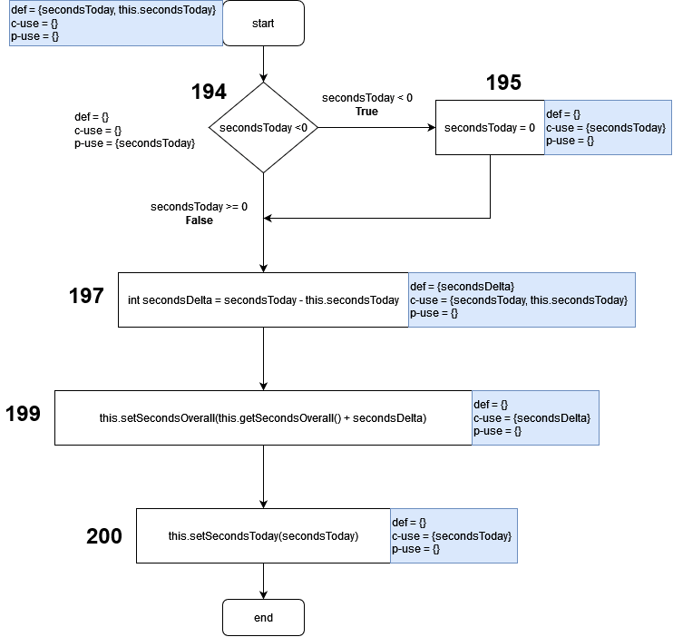

# Assignment 8 - G03P02

## Group information

- Ana Inês Oliveira de Barros - `up201806593@fe.up.pt`;
- João de Jesus Costa - `up201806560@fe.up.pt`

## Dataflow Testing

1. public int getSecondsToday()
2. public void adjustSecondsToday(int secondsToday)
3. public static int parseSeconds(String strTime)

## Dataflow Test #1

**Function**: `public int getSecondsToday()` in `Project.Java`

This function was selected because...

This function purpose is..

### Dataflow Graph

### Def-use pairs

#### Variable this.secondsToday

| Pair ID | Def   | Use | Path           |
| ------- | ----- | --- | -------------- |
| 1       | Start | 154 | `<Start, 154>` |

#### Variable seconds

| Pair ID | Def | Use | Path                        |
| ------- | --- | --- | --------------------------- |
| 1       | 154 | 158 | `<154, 156, 157, 158>`      |
| 2       | 154 | 163 | `<154, 156, 163>`           |
| 3       | 154 | 163 | `<154, 156, 157, 160, 163>` |
| 4       | 154 | 158 | `<154, 156, 157, 158>`      |
| 5       | 158 | 163 | `<158, 163>`                |

### All defs

- `this.secondsToday` - pair ID 1
- `seconds` - pair IDS 1 and 5

### Unit Test

Brief description of the test... Brief description of the outcome and whether it
fails...

## Dataflow Test #2

**Function**: `public int adjustSecondsToday()` in `Project.Java`

### Dataflow Graph

### Unit Test

## Dataflow Test #3

**Function**: `public static int parseSeconds(String strTime)` in
`ProjectTime.Java`

### Dataflow Graph

### Unit Test

