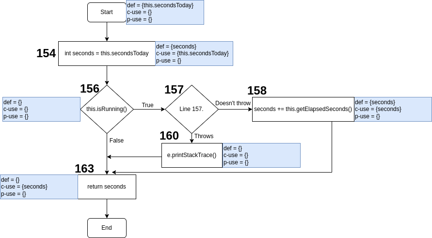
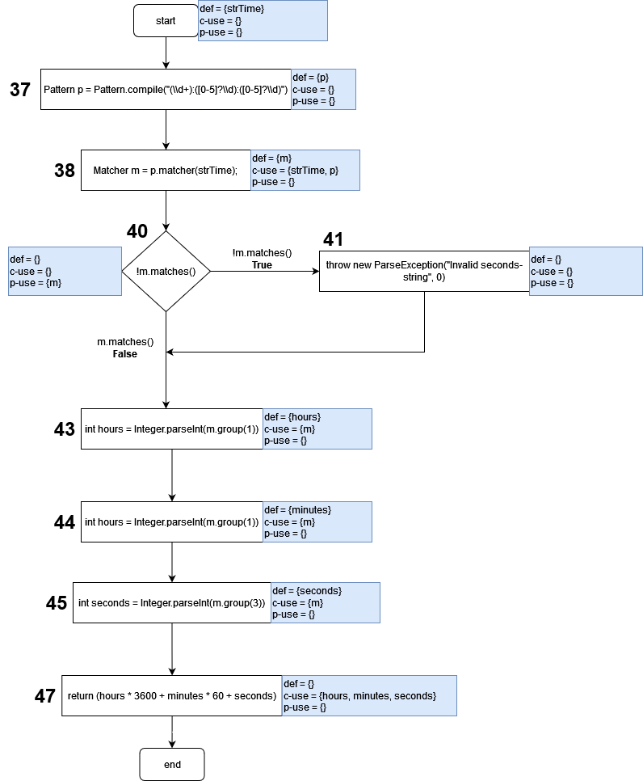

# Assignment 8 - G03P02

## Group information

- Ana Inês Oliveira de Barros - `up201806593@fe.up.pt`;
- João de Jesus Costa - `up201806560@fe.up.pt`

## Dataflow Testing

## Dataflow Test #1

**Function**: `public int getSecondsToday()` in `Project.Java`

This function was selected because...

This function purpose is..

### Dataflow Graph

### Unit Test

Brief description of the test...
Brief description of the outcome and whether it fails...

## Dataflow Test #2

**Function**: `public int adjustSecondsToday()` in `Project.Java`

### Dataflow Graph

### Def-use pairs

#### Variable secondsToday

| **Pair ID** | **Def** | **Use** |           **Path**          |
|:-----------:|:-------:|:-------:|:---------------------------:|
|      1      |  start  |   194   |         <start,194>         |
|      2      |  start  |   195   |       <start,194,195>       |
|      3      |  start  |   197   |     <start,194,195,197>     |
|      4      |  start  |   197   |       <start,194,197>       |
|      5      |  start  |   200   | <start,194,195,197,199,200> |
|      6      |  start  |   200   |   <start,194,197,199,200>   |

#### Variable this.secondsToday

| **Pair ID** | **Def** | **Use** |   **Path**  |
|:-----------:|:-------:|:-------:|:-----------:|
|      1      |  start  |   197   | <start,197> |

#### Variable secondsDelta

| **Pair ID** | **Def** | **Use** |   **Path**  |
|:-----------:|:-------:|:-------:|:-----------:|
|      1      |   197   |   199   | <start,199> |

### Unit Test

## Dataflow Test #3

**Function**: `public static int parseSeconds(String strTime)` in `ProjectTime.Java`

### Dataflow Graph

### Def-use pairs

#### Variable strTime

| **Pair ID** | **Def** | **Use** |    **Path**   |
|:-----------:|:-------:|:-------:|:-------------:|
|      1      |  start  |    38   | <start,37,38> |

#### Variable p

| **Pair ID** | **Def** | **Use** | **Path** |
|:-----------:|:-------:|:-------:|:--------:|
|      1      |    37   |    38   |  <37,38> |

#### Variable m

| **Pair ID** | **Def** | **Use** |       **Path**      |
|:-----------:|:-------:|:-------:|:-------------------:|
|      1      |    38   |  (40,T) |      <38,40,41>     |
|      2      |    38   |  (40,F) |      <38,40,43>     |
|      3      |    38   |    43   |      <38,40,43>     |
|      4      |    38   |    43   |    <38,40,41,43>    |
|      5      |    38   |    44   |    <38,40,43,44>    |
|      6      |    38   |    44   |   <38,40,41,43,44>  |
|      7      |    38   |    45   |   <38,40,43,44,45>  |
|      8      |    38   |    45   | <38,40,41,43,44,45> |

#### Variable hours

| **Pair ID** | **Def** | **Use** |   **Path**    |
|:-----------:|:-------:|:-------:|:-------------:|
|      1      |    43   |    47   | <43,44,45,47> |

#### Variable minutes

| **Pair ID** | **Def** | **Use** |  **Path**  |
|:-----------:|:-------:|:-------:|:----------:|
|      1      |    44   |    47   | <44,45,47> |

#### Variable seconds

| **Pair ID** | **Def** | **Use** | **Path** |
|:-----------:|:-------:|:-------:|:--------:|
|      1      |    45   |    47   | <45,47>  |

### Unit Test