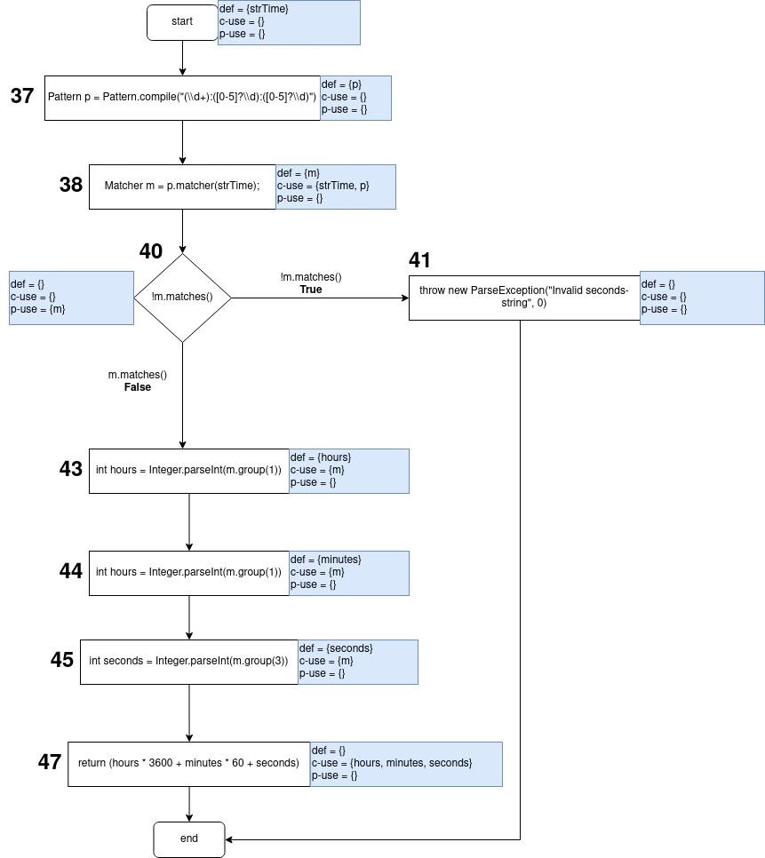

# Assignment 8 - G03P02

## Group information

- Ana Inês Oliveira de Barros - `up201806593@fe.up.pt`;
- João de Jesus Costa - `up201806560@fe.up.pt`

## Dataflow Testing

## Dataflow Test #1

**Function**: `public int getSecondsToday()` in `Project.Java`

This function was selected because...

This function purpose is..

### Dataflow Graph

### Unit Test

Brief description of the test...
Brief description of the outcome and whether it fails...

## Dataflow Test #2

**Function**: `public int adjustSecondsToday()` in `Project.Java`

### Dataflow Graph

### Unit Test

## Dataflow Test #3

**Function**: `public static int parseSeconds(String strTime)` in `ProjectTime.Java`

### Dataflow Graph

### Unit Test