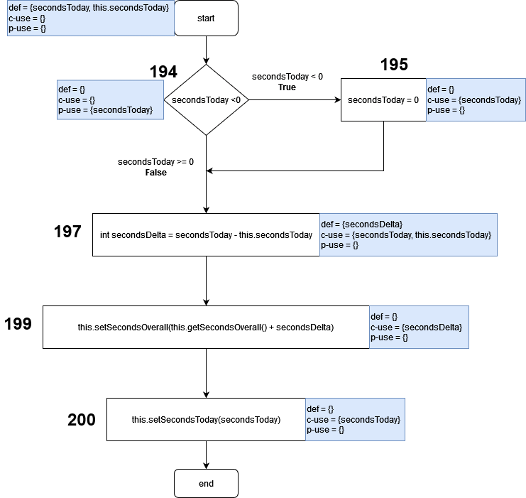

# Assignment 8 - G03P02

## Group information

- Ana Inês Oliveira de Barros - `up201806593@fe.up.pt`;
- João de Jesus Costa - `up201806560@fe.up.pt`

## Dataflow Testing

Dataflow testing is a white-box testing technique based on finding the test 
paths of a program according to the locations of definitions and uses of 
variables in the program.

## Dataflow Test #1

**Function**: `public int getSecondsToday()` in `Project.Java`

**Purpose:** This function returns the number of seconds that a project
has been active for the current day. 

**Reason for selection**: It is crucial that this function works as intended 
since other important functions rely on it.

### Dataflow Graph

### Def-use pairs

#### Variable this.secondsToday

| Pair ID | Def   | Use | Path           |
| ------- | ----- | --- | -------------- |
| 1       | Start | 154 | `<Start, 154>` |

**Coverage criteria**:
- **all-defs**: {1}
- **all-c-uses**: {1}
- **all-p-uses**: {}
- **all-uses**: {1}

#### Variable seconds

| Pair ID | Def | Use | Path                        |
| ------- | --- | --- | --------------------------- |
| 1       | 154 | 158 | `<154, 156, 157, 158>`      |
| 2       | 154 | 163 | `<154, 156, 163>`           |
| 3       | 154 | 163 | `<154, 156, 157, 160, 163>` |
| 4       | 158 | 158 | `<158, 158>`                |
| 5       | 158 | 163 | `<158, 163>`                |

**Coverage criteria**:
- **all-defs**: {2,4}
- **all-c-uses**: {1,2,4,5}
- **all-p-uses**: {}
- **all-uses**: {1,2,4,5}

### Unit Tests

The created test checks if the function returns the correct value of seconds.
This value depends on whether the project is running or not. We ran the test for 
a running project and a stopped project to cover all paths according to the 
criteria.

All tests pass **successfully**.

## Dataflow Test #2

**Function**: `public void adjustSecondsToday(int secondsToday)` in 
`Project.Java`

**Purpose:** This function receives an integer representing the number of
seconds that it took to complete a task. Then, the function updates the number
of seconds spent on the task today, as well as the overall time spent on it.

**Reason for selection**: Throughout the usage of the application, the user is
able to set the time spent on a task. As such, this is a method that deals with
user input, so it needs to be reliable.

### Dataflow Graph

### Def-use pairs

#### Variable secondsToday

| **Pair ID** | **Def** | **Use** |          **Path**           |
| :---------: | :-----: | :-----: | :-------------------------: |
|      1      |  start  | (194,T) |       <start,194,195>       |
|      2      |  start  | (194,F) |       <start,194,197>       |
|      3      |  start  |   195   |       <start,194,195>       |
|      4      |  start  |   197   |       <start,194,197>       |
|      5      |  start  |   200   | <start,194,195,197,199,200> |
|      6      |  start  |   200   |   <start,194,197,199,200>   |

**Coverage criteria**:
- **all-defs**: {1}
- **all-c-uses**: {3,4,6}
- **all-p-uses**: {1,2}
- **all-uses**: {1,2,3,4,6}

#### Variable this.secondsToday

| **Pair ID** | **Def** | **Use** |  **Path**   |
| :---------: | :-----: | :-----: | :---------: |
|      1      |  start  |   197   | <start,197> |

**Coverage criteria**:
- **all-defs**: {1}
- **all-c-uses**: {1}
- **all-p-uses**: {}
- **all-uses**: {1}

#### Variable secondsDelta

| **Pair ID** | **Def** | **Use** |  **Path**   |
| :---------: | :-----: | :-----: | :---------: |
|      1      |   197   |   199   | <start,199> |

**Coverage criteria**:
- **all-defs**: {1}
- **all-c-uses**: {1}
- **all-p-uses**: {}
- **all-uses**: {1}

### Unit Tests

The created test checks if the function adjusts the number of seconds of a 
project correctly. We ran the test for a negative and a positive input to 
cover all paths according to the criteria.

All tests pass **successfully**.

## Dataflow Test #3

**Function**: `public static int parseSeconds(String strTime)` in
`ProjectTime.Java`

**Purpose**: This function receives a string representing time, in `hh:mm:ss`
format, and returns the total number of seconds it represents.

**Reason for selection**: This method deals with parsing of user input, which
needs to be robust.

### Dataflow Graph

### Def-use pairs

#### Variable strTime

| **Pair ID** | **Def** | **Use** |   **Path**    |
| :---------: | :-----: | :-----: | :-----------: |
|      1      |  start  |   38    | <start,37,38> |

**Coverage criteria**:
- **all-defs**: {1}
- **all-c-uses**: {1}
- **all-p-uses**: {}
- **all-uses**: {1}

#### Variable p

| **Pair ID** | **Def** | **Use** | **Path** |
| :---------: | :-----: | :-----: | :------: |
|      1      |   37    |   38    | <37,38>  |

**Coverage criteria**:
- **all-defs**: {1}
- **all-c-uses**: {1}
- **all-p-uses**: {}
- **all-uses**: {1}

#### Variable m

| **Pair ID** | **Def** | **Use** |     **Path**     |
| :---------: | :-----: | :-----: | :--------------: |
|      1      |   38    | (40,T)  |    <38,40,41>    |
|      2      |   38    | (40,F)  |    <38,40,43>    |
|      3      |   38    |   43    |    <38,40,43>    |
|      4      |   38    |   44    |  <38,40,43,44>   |
|      5      |   38    |   45    | <38,40,43,44,45> |

**Coverage criteria**:
- **all-defs**: {1}
- **all-c-uses**: {3,4,5}
- **all-p-uses**: {1,2}
- **all-uses**: {1,2,3,4,5}

#### Variable hours

| **Pair ID** | **Def** | **Use** |   **Path**    |
| :---------: | :-----: | :-----: | :-----------: |
|      1      |   43    |   47    | <43,44,45,47> |

**Coverage criteria**:
- **all-defs**: {1}
- **all-c-uses**: {1}
- **all-p-uses**: {}
- **all-uses**: {1}

#### Variable minutes

| **Pair ID** | **Def** | **Use** |  **Path**  |
| :---------: | :-----: | :-----: | :--------: |
|      1      |   44    |   47    | <44,45,47> |

**Coverage criteria**:
- **all-defs**: {1}
- **all-c-uses**: {1}
- **all-p-uses**: {}
- **all-uses**: {1}

#### Variable seconds

| **Pair ID** | **Def** | **Use** | **Path** |
| :---------: | :-----: | :-----: | :------: |
|      1      |   45    |   47    | <45,47>  |

**Coverage criteria**:
- **all-defs**: {1}
- **all-c-uses**: {1}
- **all-p-uses**: {}
- **all-uses**: {1}

### Unit Tests
The created test checks if the function parsed the string representing a 
timestamp correctly. We ran the test for one valid and another invalid input to 
cover all paths according to the criteria.

All tests pass **successfully**.
