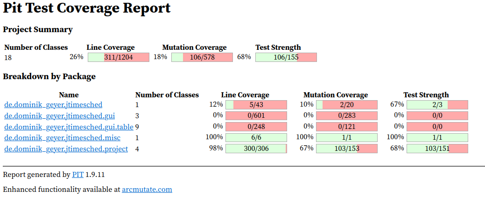
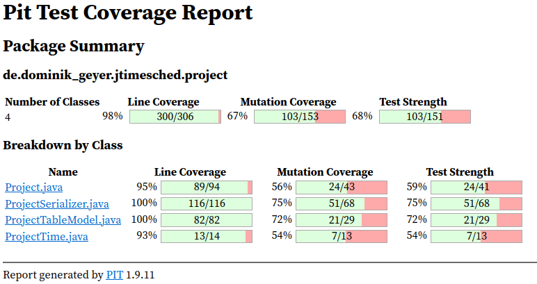
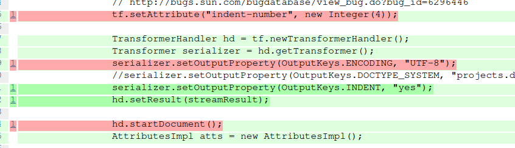

# Assignment 9 - G03P02

## Group information

- Ana Inês Oliveira de Barros - `up201806593@fe.up.pt`;
- João de Jesus Costa - `up201806560@fe.up.pt`

## Mutation score at the beginning of the assignment

The mutation score on the `project` package:

## Tests

### ProjectTime

- formatSecondsBig

### ProjectSerializer

- readWriteXmlTest - timedProject nos inputs
- readWriteXmlTest - quotaProject nos inputs
- readWriteXmlTest - titledProject nos inputs

Problems:

- writeXml:
  - Indent de 4 e charset UTF-8 são os defaults do writer => não conseguimos
    apanhar nos testes
  - o `atts.clear()` antes do `addXmlAttribute` das quotas não faz nada
    (equivalente mutant)
  - o start e end do documents e o flush/close da output stream não parecem
    fazer efeito em Linux
- readXml:
  - tem um `System.out.println` para debug, que não conseguimos testar

### Project

- toStringTest
- notesTest
- pauseRunningTest
- getSecondsTodayRunningTest
- getSecondsOverallRunningTest

Problems:

- `setSecondsOverall`, `setSecondsToday`, `adjustSecondsToday`:
  - Mudar a condition boundary não faz diferença (se for 0, dá set 0) =>
    equivalent mutant
- `getSecondsToday`, `getSecondsOverall`:
  - `e.printStackTrace` can't test the print of the stack trace (furthermore,
    the catch statement is unreachable)

### Ignored

- ProjectTableModel - setValueAt() - ternario no logger é uma lib extyerna, n
  vale a pena testar/mock

## Equivalent mutants

