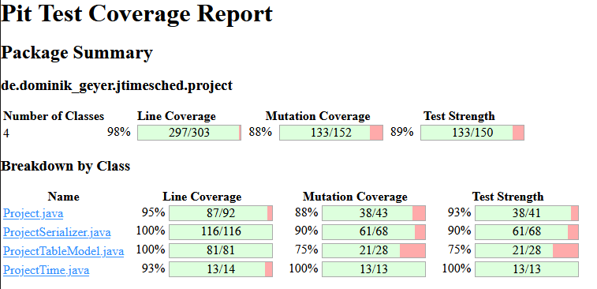

# Assignment 9 - G03P02

## Group information

- Ana Inês Oliveira de Barros - `up201806593@fe.up.pt`;
- João de Jesus Costa - `up201806560@fe.up.pt`

## Mutation Testing

Mutation testing is a white-box testing technique that evaluates the quality of
existing software tests. Mutation testing measures the percentage of killed
mutants. Mutants are different versions of the program. If the test suite killed
the mutant, it means that the test suite was able to detect the mutation.

## Coverage report at the start

The mutation score on the `project` package:

**Summary**:

- 0% line and mutation coverage in GUI-related packages.
- 100% mutation coverage on the misc package.
  - It has one simple format function.
- 67% mutation coverage on the Project package.
  - We will focus on raising this percentage as much as possible for this
    assignment.
  - Line coverage is very high (98%).
  - Mutation coverage needs work, specially in `Project.java` and
    `ProjectTime.java`.

## Unit Tests

This section provides a brief description of the tests created for each class to
increase the mutation score.

### ProjectTime

For this class, it was enough to create one test,
`public void formatSecondsBig()` (`ProjectTimeTest.java` line 156), to achieve
**100%** mutation coverage. This test passes a large number as an argument to
the `ProjectTime.formatSeconds(int s)` method.

### ProjectSerializer

#### readWriteXml test (`ProjectSerializerTest.java` line 49)

For `ProjectSerializer` tests, we added three new parameters to the
`public static Stream<Arguments> readWriteXmlInputs()` parametrized test. Each
parameter represents a project with different characteristics. The new
parameters are:

- **timedProject**: a project with timed values set (e.g.: created time).
- **quotaProject**: a project with a set quota.
- **titledProject**: a titled project.

**Note**: This parametrized test has a `System.out.println`, which we can not
test, preventing us from reaching the 100% mutation coverage mark.

#### xmlContent test (`ProjectSerializerTest.java` line 102)

We created a new test, `public void xmlContentTest()`, which takes a singleton
projects list and saves the project's information into an `xml` file. Then, the
test succeeds if the file's content equals the expected content.

**Problems**:

These tests attempt to cover all possible mutations from the
`public synchronized void writeXml(List<Project> projects)` method. However,
this was not possible.

The first problem is that we can not kill a mutant where the following line of
code is removed. This is because UTF-8 is the default encoding of the writer.

- `serializer.setOutputProperty(OutputKeys.ENCODING, "UTF-8");`

The following line appears to suffer from the same problem:

- `tf.setAttribute("indent-number", new Integer(4));`

Next, the line `atts.clear()` in `ProjectSerializer.java`:95, does not affect
anything. The mutant that removes this line is considered an **equivalent
mutant**. This contrasts with the other `atts.clear()` in the method, because it
is setting attributes with the exact same name as the previous ones (it replaces
them).

Finally, the following lines of code seem to behave differently on Windows and
Linux. The tests were run on Linux and, on this system, their presence doesn't
appear to affect the result of the method.

- `hd.startDocument();`
- `hd.endDocument();`
- `out.flush();`
- `out.close();`

### Project

We created a series of tests for this class:

- `toStringTest()` (`ProjectTest.java` line 254) that tests whether the
  `toString()` method of a project works as expected.
- `notesTest()` (`ProjectTest.java` line 266) that checks if the program
  retrieves the notes of a project correctly.
- `elapsedSecondsTest()` (`ProjectTest.java` line 96) that checks whether the
  number of elapsed seconds of a running project is correct.
- `quotaTest()` (`ProjectTest.java` line 280) that checks if the program sets
  and retrieves the quota of a project correctly.
- `pauseRunningTest()` (`ProjectTest.java` line 156) that checks whether the
  number of elapsed seconds of a paused project is within the expected margin.
- `getSecondsTodayRunningTest()` (`ProjectTest.java` line 222) that succeeds if
  the correct number of `secondsToday` retrieved for a running test is within
  the expected margin.
- `getSecondsOverallRunningTest()` (`ProjectTest.java` line 238) that succeeds
  if the correct number of `secondsOverall` retrieved for a running test is
  within the expected margin.

**Problems**:

There are still some problems with this class that prevent us from achieving
100% mutation coverage.

The first problem is caused by the multiple unreachable _catch statements_ and
`e.printStackTrace` prints which we are unable to test. These are present in the
following methods `Project.java` methods:

- `public int getSecondsToday()`;
- `public int getSecondsOverall()`;

The second one involves mutants that changed a conditional boundary and that
were not killed. The condition involved (`if (secondsToday < 0)`) does not
affect the program if the variable in the condition is already equal to 0. These
are considered to be **equivalent mutants**. This case appears in three
different methods:

- `public void setSecondsOverall(int secondsOverall)`;
- `public void setSecondsToday(int secondsToday)`;
- `public void adjustSecondsToday(int secondsToday)`;

### ProjectTableModel

We didn't increase the mutation score for this class.

- There are several lines of code that are related with the GUI. These are all
  the lines that start with "fireTableRows".
- In the method `setValueAt()`, there are some logger calls which we did not
  test because it is not worth mocking the logger (we would be testing Java's
  implementation).

## Equivalent mutants

These are the equivalent mutants by package that were already discussed
previously.

### Project

- 3 equivalent mutants.
- Mutants changed a conditional boundary. The variable on the condition can
  already be equal to 0.

### ProjectSerializer

- Mutant removed the line that sets the character set as UTF-8. This doesn't
  affect anything since this is the default character set.
  

- Mutant removed the line `atts.clear()`. It does not affect anything.
  

## Final coverage report

In the end, we were able to achieve the following scores in mutation coverage:

- `project` package: 88% (+20%).
- `Project.java`: 88% (+32%).
- `ProjectSerializer.java`: 90% (+15%).
- `ProjectTableModel.java`: 75% (+3%).
- `ProjectTime.java`: 100% (+46%).

Score on the `project` package:

**Note**: the mutation score achieved is higher on systems running Windows. The
`ProjectSerializer` has higher coverage on Windows, because the mutants that
remove that calls to close file descriptors are killed.
